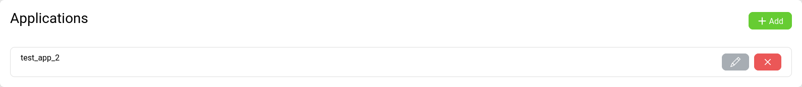
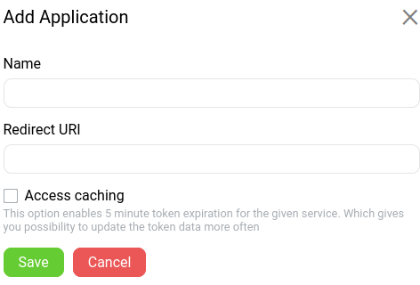
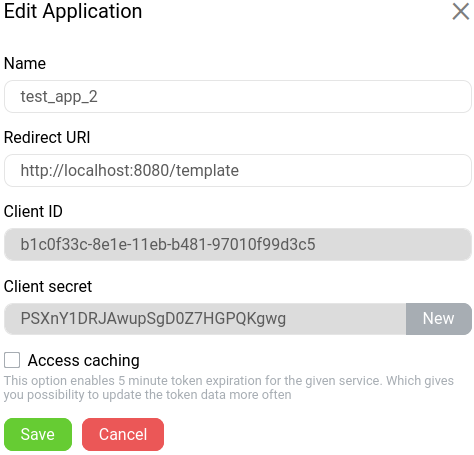

# Vue Plugin to handle invitation data on client app

## Installation
Add scripts to your page 
```
    <script src="https://unpkg.com/vue"></script>
    <script src="https://unpkg.com/gtn-widget-wc"></script>
```

## Usage
Visit [kyc-servie](https://test.id.gtn.ee)

Click on Applications link and then add button:



Fill application data:



After save you can watch application properties:



Use as simple html tag

````
    <invite-widget 
        client="your client id">
    </invite-widget>
````
